# What Academic Studio is {background-color="#7a1420"}

## A workspace with an assistant built in

::: {.columns}
::: {.column width="52%"}
Academic Studio is a place to keep your project files and work on them with an AI assistant called Claude, side by side.

- Your files are on the left
- Claude is on the right
- You can ask Claude to do the work, or do it yourself

Under the hood it is VS Code, a professional tool used by millions of programmers --- but set up to be simple, with Claude ready the moment it opens.
:::
::: {.column width="48%"}
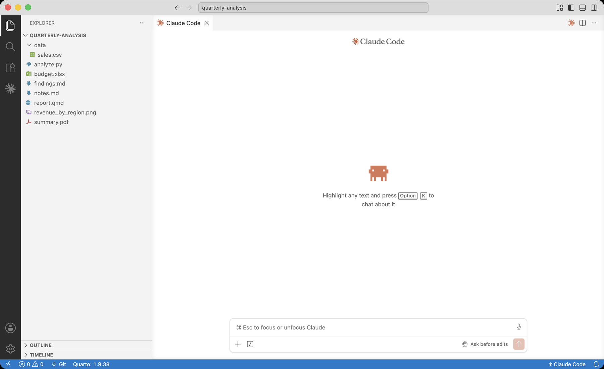{.shot}
:::
:::

::: {.small style="color:#9a9da2; margin-top:0.5em;"}
Move through this tour with the → arrow keys, or the arrows at the bottom-right.
:::

## The five areas of the screen {.smaller}

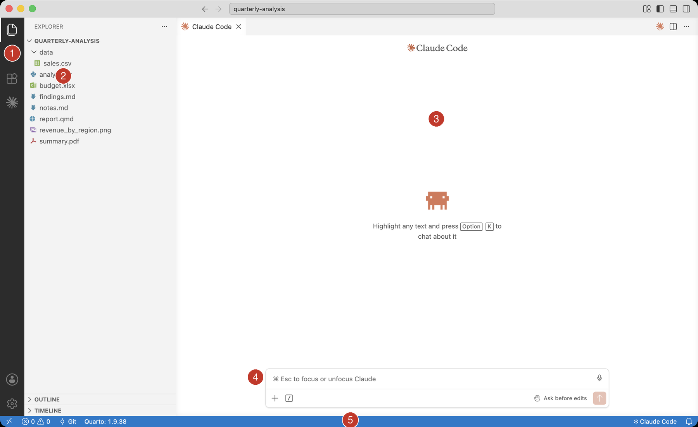{.shot width="82%"}

::: {.small}
1. Activity Bar --- the icons on the far left switch what the side panel shows
2. Explorer --- the files in your project folder
3. The main panel --- where your files open, and where Claude lives
4. Ask Claude --- type your request in this box and press Enter
5. Status Bar --- small readouts along the very bottom
:::

## The Activity Bar {.smaller}

The narrow strip of icons on the far left. Each one opens a different panel.

::: {.columns}
::: {.column width="60%"}
- 📄 Explorer --- your files
- 🔍 Search --- find text across every file
- 🧩 Extensions --- add-ons that give new abilities
- ✳️ Claude Code --- the assistant
- ⚙️ Settings (bottom) --- preferences and your account
:::
::: {.column width="40%"}
Click an icon to show its panel; click it again to hide it and give yourself more room.
:::
:::

# Working with your files {background-color="#7a1420"}

## When you first open it {.smaller}

::: {.columns}
::: {.column width="46%"}
The first time you open Academic Studio you see a Start page. From here you can:

- Open Folder --- choose the project you want to work on
- Run Setup --- install tools and pick your profile
- Help --- open the written guide

Claude opens automatically alongside it.
:::
::: {.column width="54%"}
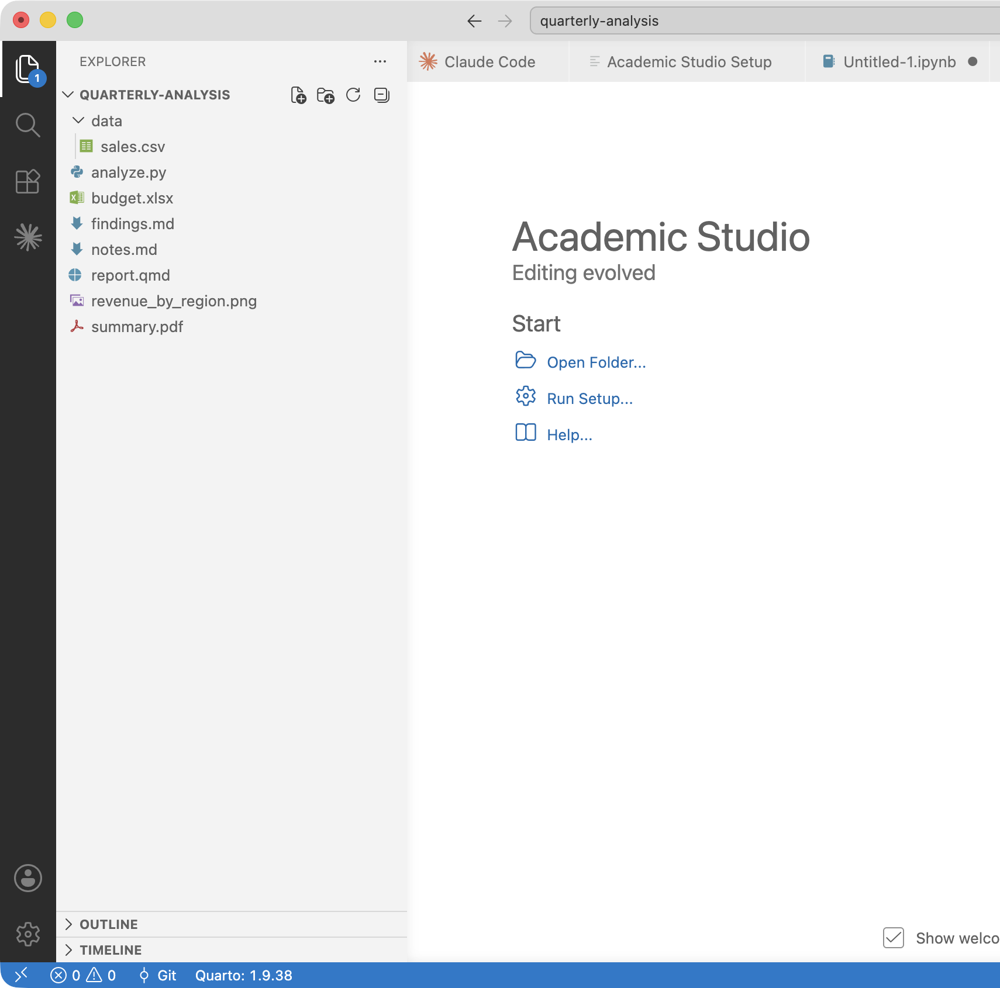{.shot}
:::
:::

## Open a folder, and your files appear {.smaller}

Everything in Academic Studio happens inside a project folder. Choose one with File → Open Folder, and its contents show up in the Explorer on the left.

::: {.columns}
::: {.column width="55%"}
- Click a file to open it in the editor
- Your work saves automatically, about a second after you stop typing
- Your Claude conversation stays with the project, so you can pick up where you left off
:::
::: {.column width="45%"}
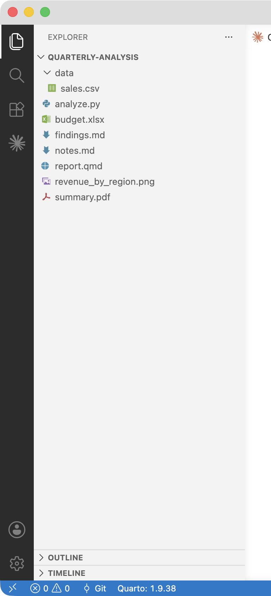{.shot}
:::
:::

## Viewing spreadsheets, PDFs, and data {.smaller}

You do not need Excel or a PDF reader --- Academic Studio previews these files for you.

::: {.columns}
::: {.column width="33%"}
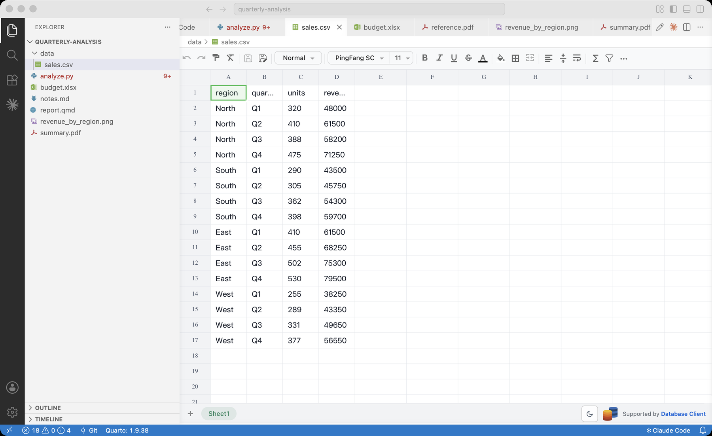{.shotmini}

Spreadsheets and CSV data open as a clean table.
:::
::: {.column width="33%"}
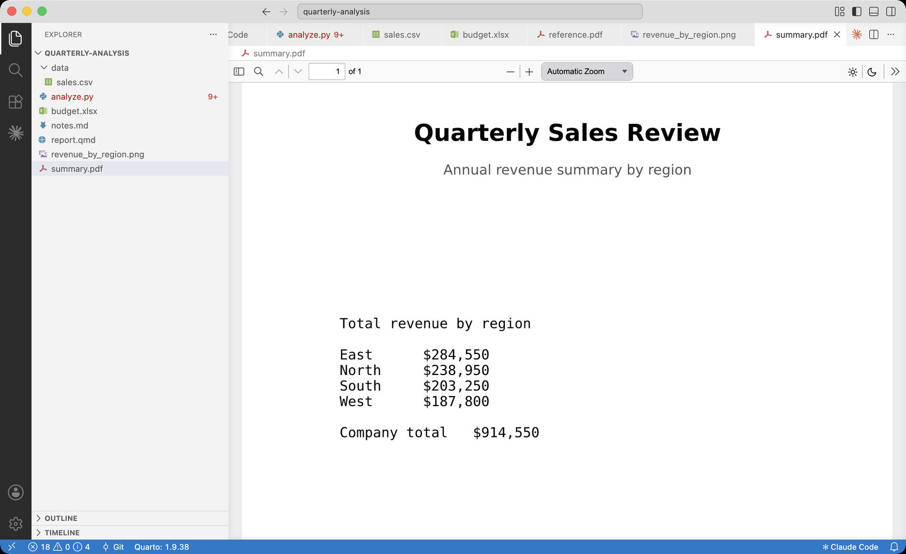{.shotmini}

PDFs open in a built-in reader.
:::
::: {.column width="33%"}
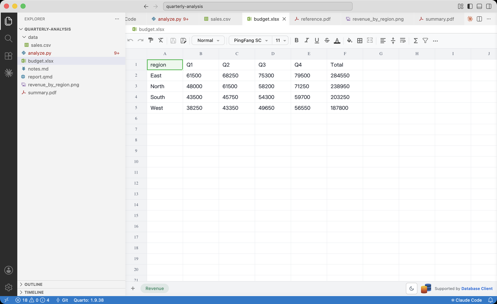{.shotmini}

Excel files show every sheet.
:::
:::

# Claude, your assistant {background-color="#7a1420"}

## Claude is ready the moment you open the app

::: {.columns}
::: {.column width="50%"}
The panel on the right is Claude Code. Type what you want in plain English at the bottom and press Enter.

The fastest way to work is usually to tell Claude what you want --- "summarize this data," "make a slide deck from these notes," "fix this error" --- and let it do the work in the folder you have open.

A paid Anthropic account is required. The first time, type `/login` in the box to sign in.
:::
::: {.column width="50%"}
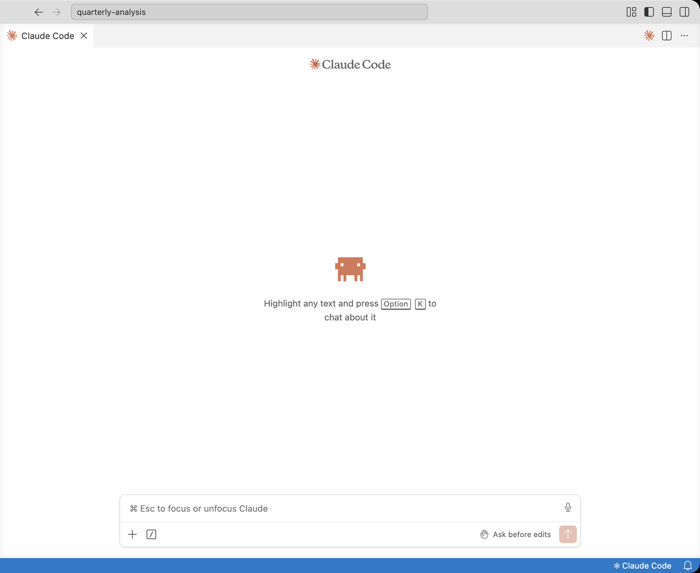{.shot}
:::
:::

## Claude can read your files {.smaller}

Because Claude works inside your folder, it can open and read your files to answer questions about them --- no copying and pasting.

::: {.columns}
::: {.column width="46%"}
Here it was asked a question about a data file and a script. It read both and answered, citing what it found.

It also works like a smart search over your own documents: ask "which file mentions the 2023 budget?" and it finds the right one even when you do not recall the name.
:::
::: {.column width="54%"}
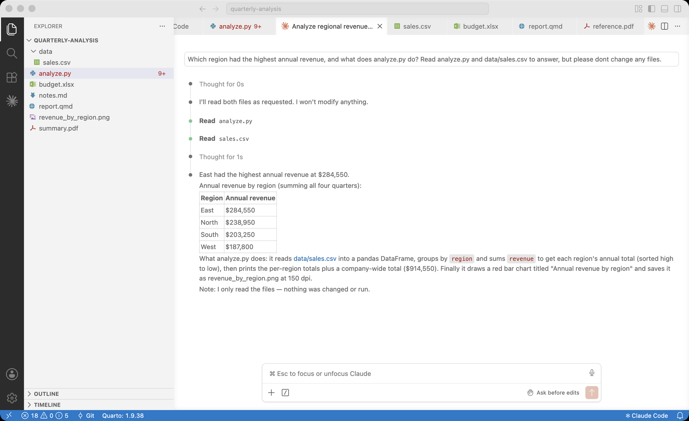{.shot}
:::
:::

## Claude can write and edit files {.smaller}

::: {.columns}
::: {.column width="54%"}
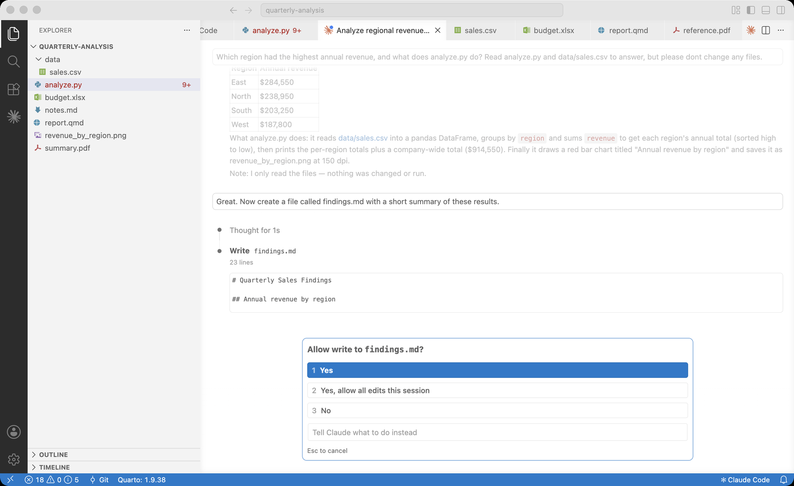{.shot}
:::
::: {.column width="46%"}
Ask Claude to create or change a file and it writes it for you, right there in your folder.

By default it shows you what it plans to do and waits for your OK before changing anything --- so you are always in control. You can review the change, then accept it.
:::
:::

# Getting around {background-color="#7a1420"}

## Menus and toolbars {.smaller}

::: {.columns}
::: {.column width="54%"}
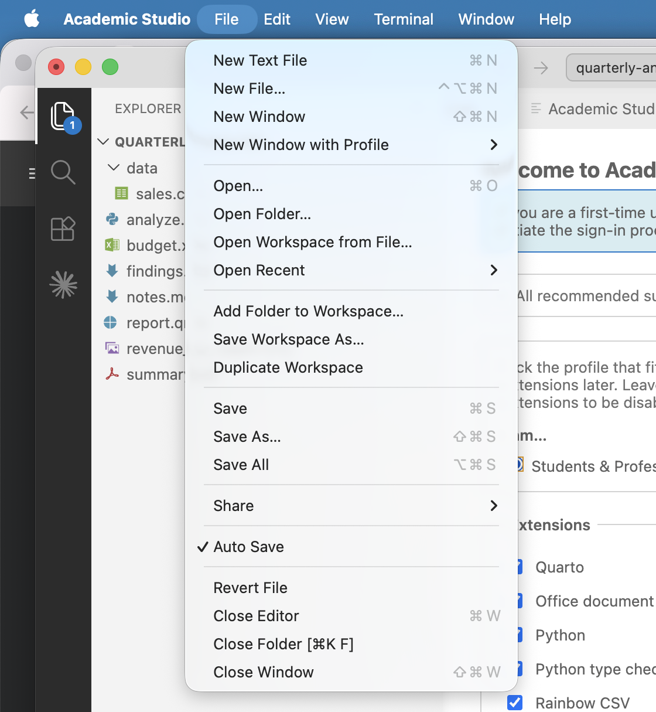{.shot}
:::
::: {.column width="46%"}
The menus (File, Edit, View, Terminal, Help, and so on) have been trimmed to the essentials, so there is less to wade through.

Toolbars are the small rows of buttons at the top of the editor. When you open a file, buttons that make sense for it appear at the top-right --- a Run button for a Python file, a Preview button for a Quarto document.
:::
:::

## Settings, if you ever need them {.smaller}

::: {.columns}
::: {.column width="46%"}
Settings is where you can change how the editor behaves --- text size, word wrap, and the like. Most people rarely open it.

When you do want it, the quickest way is the Command Palette: press <kbd>F1</kbd> to bring up a search box that can run any command in the app, then type "settings." Or simplest of all, ask Claude to change a setting for you.
:::
::: {.column width="54%"}
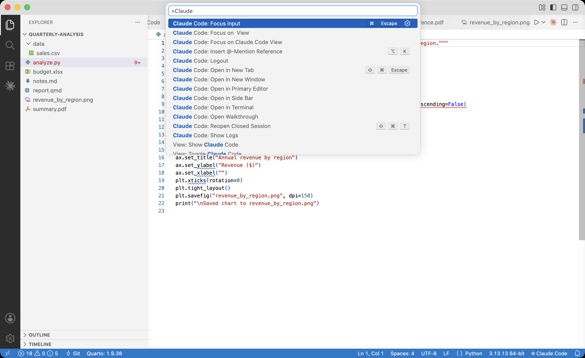{.shot}
:::
:::

## The Terminal {.smaller}

::: {.columns}
::: {.column width="46%"}
A terminal is a place to type commands for your computer to run --- things like installing a program or checking a result.

If you ever need to run a terminal command, open one with Terminal → New Terminal, then type the command and press Enter. Or, simplest of all, just ask Claude to run terminal commands for you --- it runs them and reads the results back.
:::
::: {.column width="54%"}
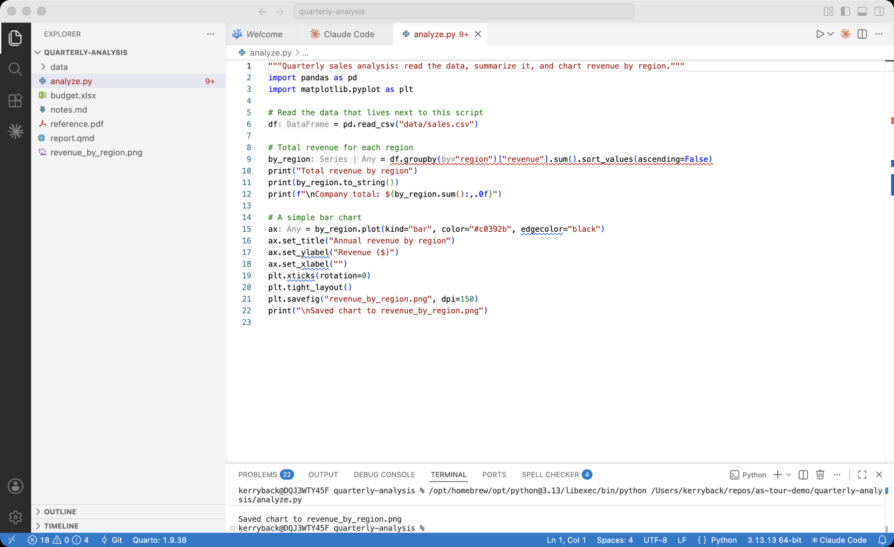{.shot}
:::
:::

# Documents and data {background-color="#7a1420"}

## The Python libraries you get {.smaller}

Run Setup installs Python with the libraries most academic and professional work needs, so `import` just works --- nothing to configure:

::: {.columns}
::: {.column width="55%"}
- pandas, NumPy --- data and tables
- Matplotlib, seaborn, Plotly --- charts and figures
- SciPy, SymPy --- scientific and symbolic math
- scikit-learn --- machine learning
- statsmodels --- statistics and regression
- openpyxl, python-docx, python-pptx --- read and write Excel, Word, and PowerPoint files
:::
::: {.column width="45%"}
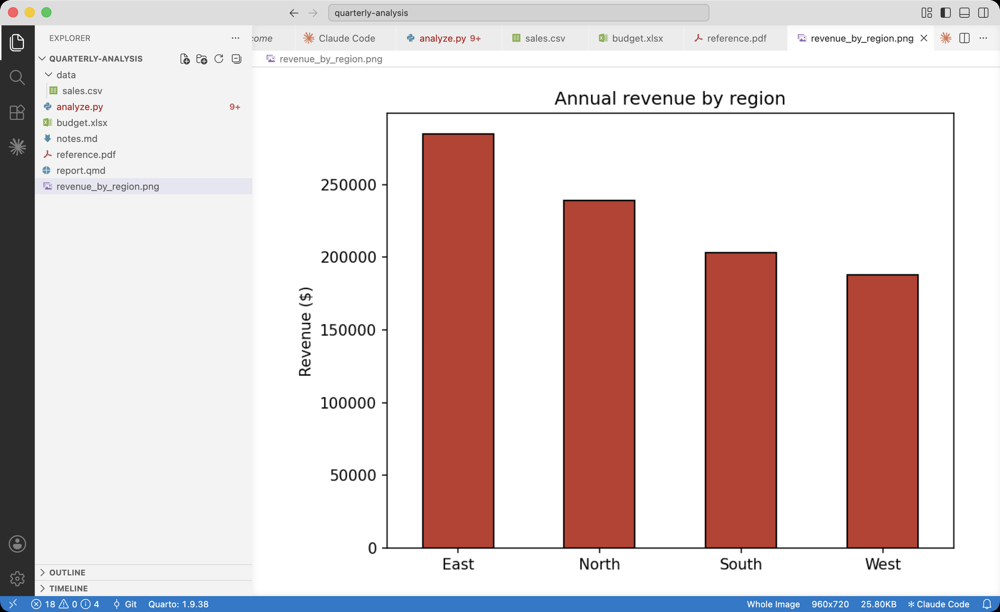{.shot}

::: {.small style="text-align:center; color:#9a9da2;"}
This chart came from a few lines of Python reading a spreadsheet.
:::
:::
:::

You need not memorize these --- ask Claude to "analyze this spreadsheet" or "fit a regression," and it uses them for you.

## Claude's installed skills {.smaller}

A skill is a ready-made ability Claude draws on by itself. Academic Studio bundles skills for producing real, shareable documents --- ask for "a budget spreadsheet" or "a ten-slide deck" and you get an actual file:

::: {.columns}
::: {.column width="46%"}
- Excel spreadsheets --- `.xlsx`
- Word documents --- `.docx`
- PowerPoint decks --- `.pptx`
- PDF files --- create, fill, and combine
- Skill-creator --- builds new skills, when you want to teach Claude a repeatable task
:::
::: {.column width="54%"}
{.shot}
:::
:::

You never turn these on or call them by name --- when you ask for a spreadsheet or a deck, Claude picks the right skill on its own. Double-click the finished file in the Explorer to preview it, as shown here.

# Setup and help {background-color="#7a1420"}

## Run Setup: pick your profile, install the tools {.smaller}

::: {.columns}
::: {.column width="46%"}
Open it from Help → Run Setup. One screen lets you:

- Choose a profile (Students & Professionals, or Faculty) which turns on the right set of extensions
- Install the supporting programs --- Python and its libraries, Node.js, Quarto --- with a single click

You can reopen it any time to add tools or change extensions.
:::
::: {.column width="54%"}
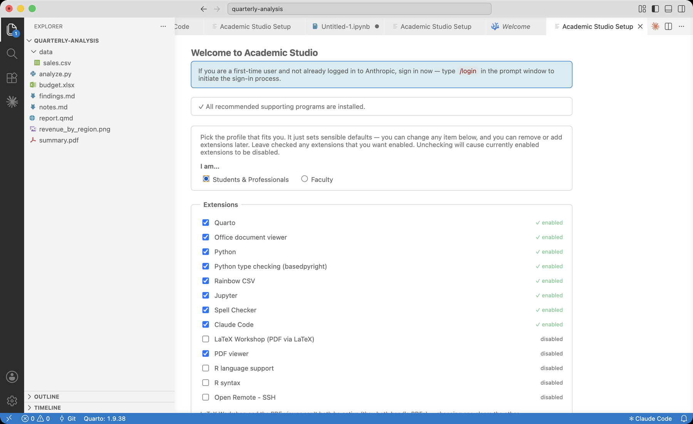{.shot}
:::
:::

## Where to get help {.smaller}

::: {.columns}
::: {.column width="54%"}
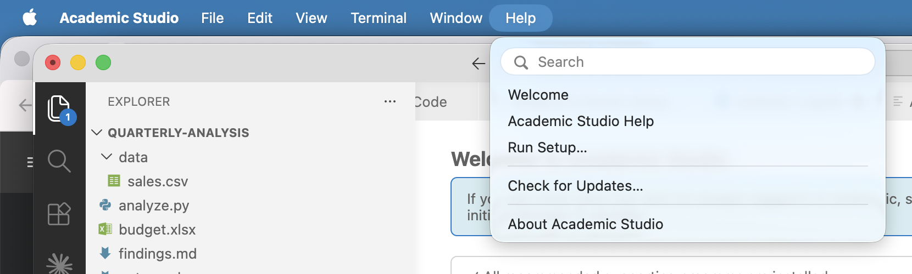{.shot}
:::
::: {.column width="46%"}
The Help menu has:

- Academic Studio Help --- a written guide to everything here
- Run Setup --- the setup screen from the last slide
- Check for Updates --- downloads a newer version when one is out

And of course, you can always just ask Claude how to do something. Tell Claude you are working in a version of VS Codium, and it will be better able to assist you.
:::
:::

## You are ready {.smaller}

::: {.columns}
::: {.column width="60%"}
A few things to remember:

- Open a folder, and your files show on the left
- Type what you want to Claude on the right --- it can read and write your files, run Python, and build documents
- Run Setup (in the Help menu) installs anything that is missing
- Academic Studio Help (in the Help menu) is a written guide to it all

When in doubt, ask Claude. Tell it what you want in plain words and let it do the work.
:::
::: {.column width="40%"}
{width="150"}

Welcome to Academic Studio.
:::
:::
